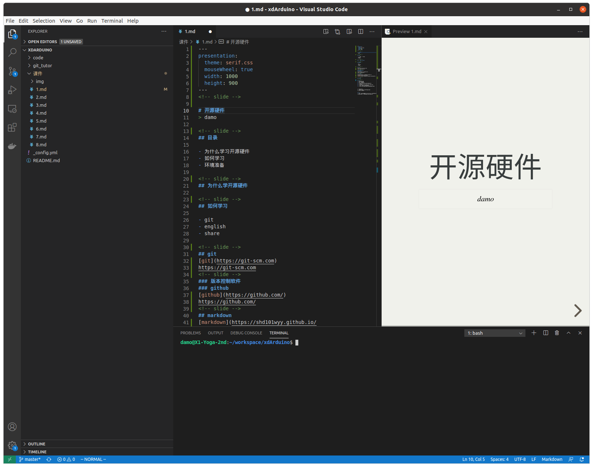

---
presentation:
  theme: serif.css
  mouseWheel: true
  width: 1000
  height: 900
---
<!-- slide -->

# 开源硬件
> damo

<!-- slide -->
## 目录

- 为什么学习开源硬件
- 如何学习
- 环境准备

<!-- slide -->
## 为什么学开源硬件

<!-- slide -->
## 如何学习

- git
- english
- share

<!-- slide -->
## git
[git](https://git-scm.com)
https://git-scm.com
<!-- slide -->
### 版本控制软件
### github
[github](https://github.com/)
https://github.com/
<!-- slide -->
## markdown
[markdown](https://shd101wyy.github.io/markdown-preview-enhanced/#/)
[mermaid](https://mermaid-js.github.io/mermaid/#/)

<!-- slide -->
## vscode


<!-- slide -->
## 作业
1. 登录github.com
2. 申请自己的账户
3. 创建一个项目仓库
4. 使用git clone命令，将项目克隆的本地
5. 在本地编辑
6. 使用git add 将修改后文件保存在本地仓库。
7. 使用git commit -m命令设置注释
8. 使用git push命令将本地项目更新提交到github。


```
1. 安装git工具
2. 设置ssh-keygen，直接访问github。
3. git的基本操作。
```

## 作业
1. 申请一个github账户，在仓库里，创建一个以xd0615命名的仓库，将今天的学习笔记整理到仓库的readme内。