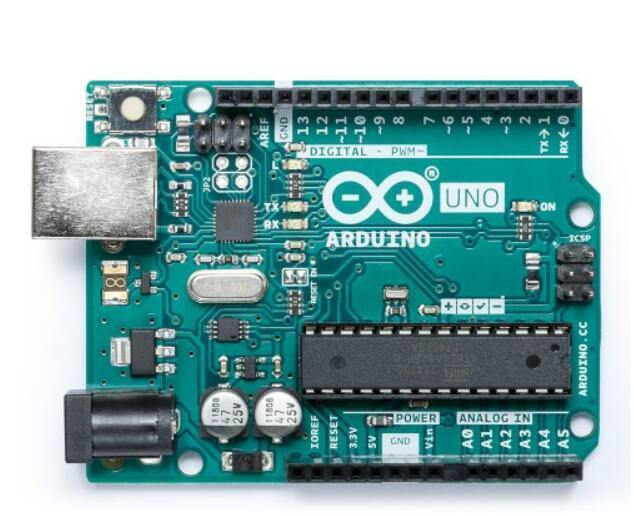
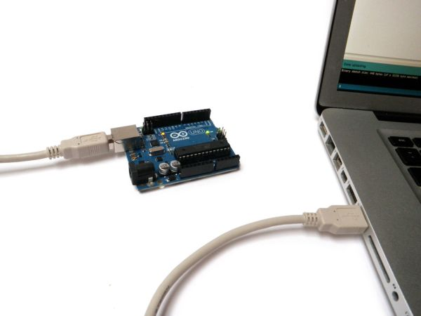
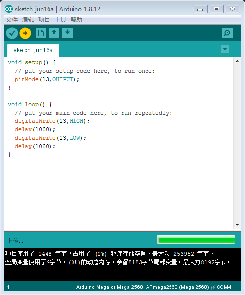
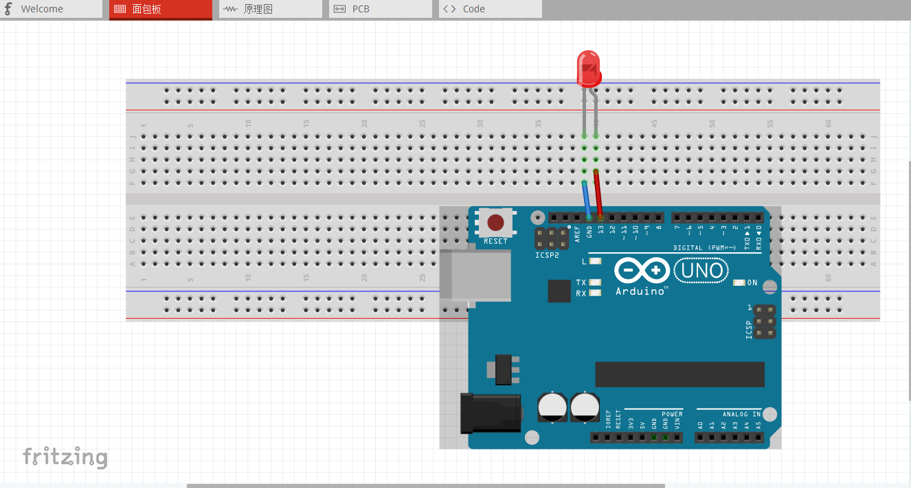
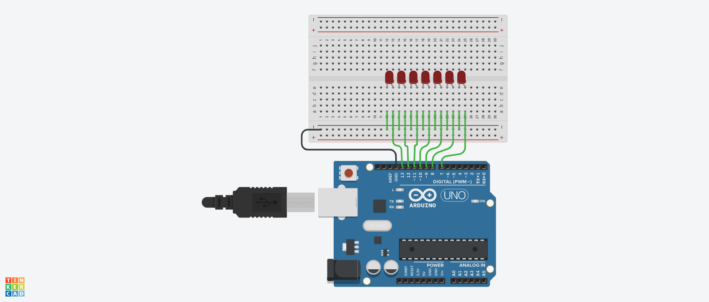

--
presentation:
  theme: serif.css
  mouseWheel: true
  width: 1000
  height: 900
---
<!-- slide -->
# 开源硬件演示
> damo
> 2020-06-16

<!-- slide -->
## 1. 开发演示

### 认识arduino


<!-- slide -->
### arduino原理图


<!-- slide -->
### arduino接口图


<!-- slide -->
### 模拟和数字信号


<!-- slide -->
### 连接图


<!-- slide -->
## 认识arduino开发环境

<!-- slide -->
### blink


<!-- slide -->
#### 常见问题处理
1. 检查代码
2. 检查端口设置和开发板型号是否匹配
3. 检查设备管理器
4. 检查驱动

<!-- slide -->
### 安装fritzing

1. 画出上述呼吸灯电路图


<!-- slide -->
## 2. 虚拟环境

https://www.tinkercad.com/


<!-- slide -->
1. 实现跑马灯



<!-- slide -->
2. code

```c
int i=13;
void setup()
{
  pinMode(13, OUTPUT);
  pinMode(12, OUTPUT);
  pinMode(11, OUTPUT);
  pinMode(10, OUTPUT);
  pinMode(9, OUTPUT);
  pinMode(8, OUTPUT);
  pinMode(7, OUTPUT);
}
void loop()
{
  for(i=13;i>=7;i--)
  {
  	digitalWrite(i, HIGH);
  	delay(500); // Wait for 1000 millisecond(s)
  	digitalWrite(i, LOW);
  	delay(500); // Wait for 1000 millisecond(s)
  }
}
```
<!-- slide -->
## 作业
1. 在昨天创建的github仓库中，增加一个文件夹，命名为"lessons2"
2. 在文件夹中，增加一张图片，是你设计的流水灯电路图，png格式。
3. 在文件夹中，增加一个led.c文件，是你的代码。
4. 将上述修改，提交到github。

<!-- slide -->
## thanks